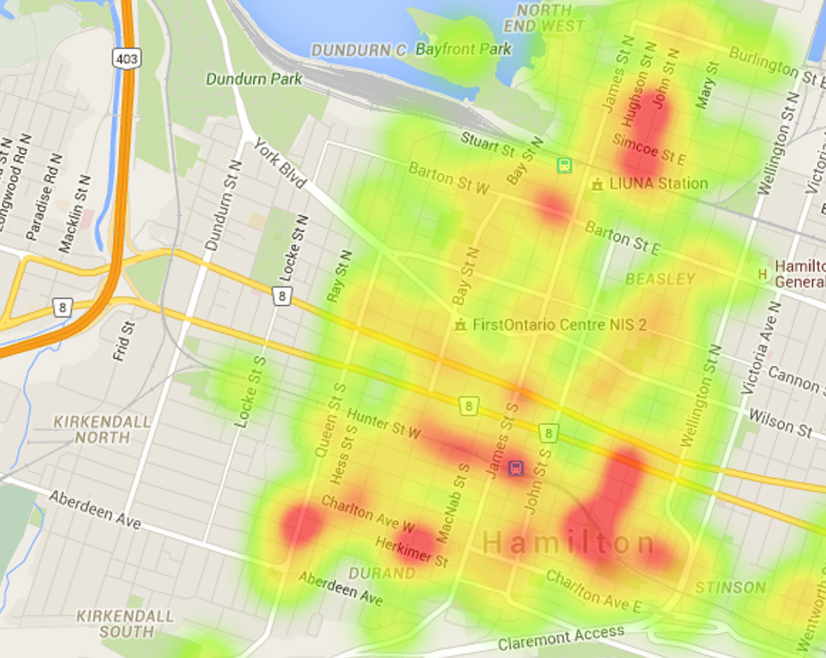

# EnLaCalle
Dentro de las nuevas iniciativas MAKER para la convivencia con el COVID-19. Desde la [comunidad Maker de Mallorca](https://makespacemallorca.org/) estamos promoviendo esta **iniciativa abierta y colaborativa** para construir una plataforma para la detección y predicción de la ocupación en espacios públicos. Con el objetivo de crear un mapa de calor que represente los niveles de densidad de población fuera de hogares y comercios.

## ¿Para qué?
**Disponer de una información útil para la ciudadanía**. Lo que no exlcuye toda iniciativa y proyecto que entidades o empresas quieran hacer de esta información respetando el derecho de reconocimiento y autoría. 
Entendemos que la prioridad es la colaboración con el cumplimiento de las recomendaciones de espaciamiento social es una manera de autoprotegerse frente al contagio del COVID-19. La plataforma EnLaCalle pretende ofrecer la información necesaria para tomar la decisión de visitar o transitar por una zona con seguridad. 

## Premisas y fundamentos
* **Protección de datos**. Todo el tratamiento de la información se hará conforme con la regulación general de protección de datos 2016/679. Con la directiva de no recoger y almancenar información de carácter personal o innecesaria. 
* **Código abierto**. Todo el software y hardware necesario para desarrollar la plataforma será de libre distribución y uso. Se ha seleccionado la [licencia MIT](https://github.com/McOrts/EnLaCalle/blob/master/LICENSE) que otorga permisos de uso comercial, distribución uso privado y las limitaciones de garantia y responsabilidad.
* **Acceso libre**. Toda la información es de libre acceso para personas e instituciones. Con la única limitación de los capacidad de los recursos de la plataforma. 
* **Colaboración**. Toda sugerencia de cambio, mejora, nuevo enfoque o crítica. Será bien venida. No hay límites en la colaboración. 

## Arquitectura

## Agradecimientos y referencias
* 陳亮手痕定律 @moononournation por el manual para montar un scanner BLE sobre ESP32 https://www.instructables.com/id/Nano-ESP32-BLE-Scanner/
* A TECHTUTORIALSX por el ejemplo de conectividad ESP32 wifi con Raspberry Pi: https://techtutorialsx.com/2018/06/21/raspberry-pi-3-flask-receiving-http-post-request-from-esp32/
